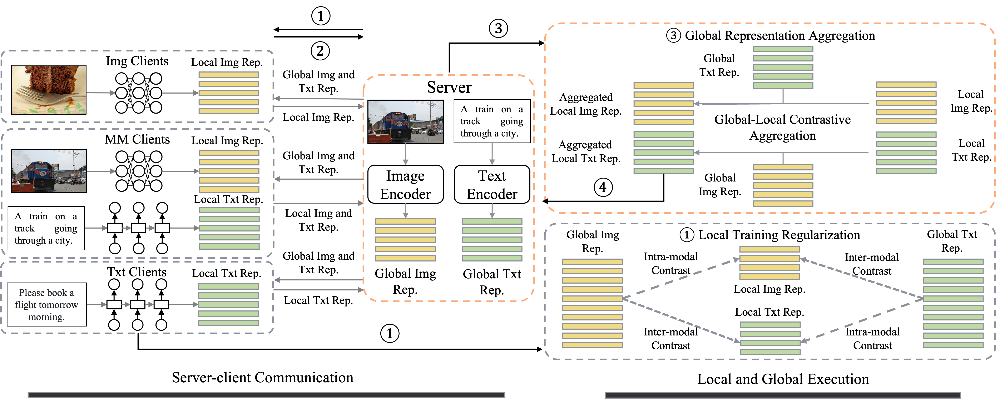

# Multimodal Federated Learning via Contrastive Representation Ensemble

This repo contains a PyTorch implementation of the paper [Multimodal Federated Learning via Contrastive Representation Ensemble](https://arxiv.org/abs/2302.08888) (ICLR 2023). 

**<font color='red'>Note: This repository will be updated in the next few days for improved readability, easier environment setup, and datasets management.</font> Please stay tuned!**



## Setup

### Environment

The required packages of the environment we used to conduct experiments are listed in `requirements.txt`.

Please note that you should install `apex` by following the instructions from https://github.com/NVIDIA/apex#installation, instead of directly running `pip install apex`.

### Datasets

For datasets, please download the MSCOCO, Flicker30K, CIFAR-100, and AG_NEWS datasets, and arrange their directories as follows:

```
os.environ['HOME'] + 'data/'
├── AG_NEWS
├── cifar100
│   └── cifar-100-python
├── flickr30k
│   └── flickr30k-images
├── mmdata
│   ├── MSCOCO
│   │   └── 2014
│   │       ├── allimages
│   │       ├── annotations
│   │       ├── train2014
│   │       └── val2014
```

## Usage

To reproduce CreamFL with BERT and ResNet101 as server models, run the following shell command:

```shell
python src/main.py --name CreamFL --server_lr 1e-5 --agg_method con_w --contrast_local_inter --contrast_local_intra --interintra_weight 0.5
```

## Citation

If you find the paper provides some insights into multimodal FL or our code useful 🤗, please consider citing:

```
@article{yu2023multimodal,
  title={Multimodal Federated Learning via Contrastive Representation Ensemble},
  author={Yu, Qiying and Liu, Yang and Wang, Yimu and Xu, Ke and Liu, Jingjing},
  journal={arXiv preprint arXiv:2302.08888},
  year={2023}
}
```

## Acknowledgements

We would like to thank for the code from [PCME](https://github.com/naver-ai/pcme) and [MOON](https://github.com/QinbinLi/MOON) repositories.
